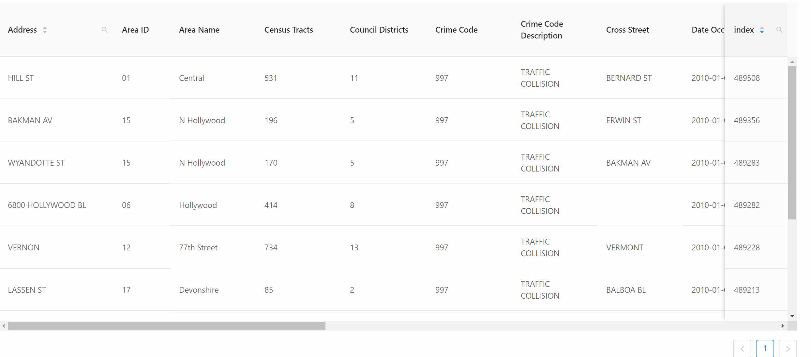

# Los Angeles Traffic Collision Viewer


## Introduction

A web app based on dataset [“Los Angeles traffic collision data"](<https://www.kaggle.com/cityofLA/los-angeles-traffic-collision-data>)  with data sorting, filtering feature and some visualization.

## Developer Guide

### Naming Convention

- For CSS/Less document, use `[BEM]`(<http://getbem.com/introduction/>) 
- For variables, use `[little caramel-case]`(<http://wiki.c2.com/?LowerCamelCase>)
- For react components, use `big caramel-case`(Actually React would check if name of component is in big caramel-case)

### Building Philosophy
1. Use [`React-Hook`](https://reactjs.org/docs/hooks-intro.html)
2. Less coupling more cohesion

### Recommend Tooles
- Jetbrain webstorm

### Remaining Work
- #### Build Front-end UI(Xirui Zhong) :heavy_check_mark:
    -Based on Ant Design Table Component
    
    ##### Requirements
  - Use `[custom theme]`(https://ant.design/docs/react/customize-theme-cn)
    
    
    DDL: 10/27
  
- #### Build backend Query function(Tao Xu):heavy_check_mark:
    - Based On Firestore API
    ##### Requirements
    - support `filtering`, `sorting` features for each column.
    
    DDL: 10/27
    
    Done, but still there are some difference from what I expected:
    
    - The API of Firebase is way too insufficient for even common query pattern, therefore we build a server to handle complex query , like range query and partial query.
    
- #### Build middle-tier server:heavy_check_mark:

    - In order to analyze complex query and return desired data.
    - make better use of firebase API
    - optimize query efficiency

    ##### description:

    - middle-tier server is based on NodeJS and equipped with a REDIS in-memory caching database. Therefore it could help to improve data accessing time.

- #### Build Frontend logic functions (Tao Xu):heavy_check_mark:

    - customize table component by slider and button component of ANTD
    - implement logic and commutation function of frontend

- #### implement Data Visualization DEMO(Tao Xu):heavy_check_mark:
    - ~~Based on D3.js~~
    - Changed to echarts.js of apache software foundatin
    #### Requirements
    - show the distribution of events on the LA map
    - good user experience
    
- #### ~~mobile device compatibility(Xirui Zhong)~~(deprecated)
    - better user experience on mobile device
    - canceled due to hardness to design a self-adaptive mechanism to present large tuples on mobile device.

- #### ~~cloud function(Tao Xu)~~(deprecated)
    - use cloud function of firebase
    - canceled due to insufficient remaining time and corresponding features.
    
- #### data visualization ~~carousel~~ option(Tao Xu) :heavy_check_mark:
    - show different data visualization charts when that area is not focused.
    

## Npm Scripts

Before start the front end, start server script first. This script is under `root/server` by the name `middle-tier_server.js`, use

```powershell
node ./middle-tier_server.js
```

or any tools based on NodeJS environment to start this backend server.


In the project directory, you can run:


### `npm start`

Runs the app in the development mode.<br>
Open [http://localhost:3000](http://localhost:3000) to view it in the browser.

Main page of this application is under URL [http://localhost:3000/app](http://localhost:3000/app) 

The page will reload if you make edits.<br>
You will also see any lint errors in the console.

### `npm run build`

Builds the app for production to the `build` folder.<br>
It correctly bundles React in production mode and optimizes the build for the best performance.

The build is minified and the filenames include the hashes.<br>

## preview


