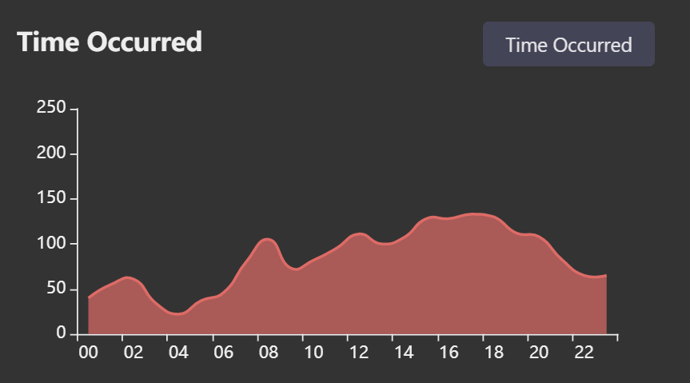

# Group Project Final Report

## Introduction

### Background

We are interested in big data sets regarding Los Angeles traffic collision. We want to know if the traffic collisions are related to certain columns such as gender, date of the year, etc. Therefore, our teams developed a web-based app which supports sorting, filtering and searching dataset so users could search data they are interested. It also equipped with the data visualization feature to help users have a better insight into the dataset.

### Idea

This project was inspired by Kaggle, a public data platform that provides dataset interface with strong query features and helpful data visualizations. In this project, our goal is to customize a dataset interface for the Los Angeles traffic collision dataset provided by Kaggle. It is a web app that supports sorting, filtering operations on the dataset with data visualization features on each data field to let users have a better insight into this dataset.

 ## Work Done

### Software Architecture

<h4 style:"font-weight:bold">
    techStack diagram
    </h4>
    

#### Firebase

Firebase is a SaaS database currently provided and maintained by Google. We use Firebase as the main data storage by the instruction of project guideline. Unfortunately, it is not useful as estimated for its insufficient support on data query function. The real time database, which is known as the one of main product provided by Firebase, does not even support range query and complex query. Those queries are supported even by ancient databases of last century like MySQL. Therefore, Firebase is only used as the online storage, and we use a middle tier server instance implemented by NodeJS to handle actual requests.

#### NodeJS Middle-tier Server

Due to incapability of firebase on real-time data query, request of frontend is handled by a middle-tier server instance implemented by NodeJS. This server receives requests from frontend and response with data according to the query information in the request. It equipped with an in-memory database (based on Redis) for faster data processing.

#### Redux

In the frontend, the whole application mainly formed by two component, one is the table part for presenting data tuples, and the other is a sider bar for data visualization. Apparently many component interactions are involved. Therefore we use Redux as the application state managing unit, it stores the returning data from NodeJS and all other component subscribe the data and update UI when this data updates. Redux also is responsible to send the data queries.

#### ReactDOM

ReactDOM is the uppermost level of our project, it directly interacts with user and send update request to Redux. 

### Involved Opensource Projects

- AntDesign
  - An enterprise-class UI *design* language and React UI library with a set of high-quality React components, one of best React UI library for enterprises.
- ECharts
  - *ECharts*, a powerful, interactive charting and visualization library for browser.

### Frontend Implement Detail

#### Naming Convention

- For CSS/Less document, use `[BEM]`(<http://getbem.com/introduction/>) 
- For variables, use `[little caramel-case]`(<http://wiki.c2.com/?LowerCamelCase>)
- For react components, use `big caramel-case`(Actually React would check if name of component is in big caramel-case)

#### Building Philosophy

1. Use [`React-Hook`](https://reactjs.org/docs/hooks-intro.html)
2. Less coupling more cohesion

#### Feature implement detail

- Sorting
  - Ant Design provides powerful sorting API, we implemented sorting feature by passing a compare function to different data fields.
- Filtering
  - Filtering feature is mainly based on middle-tier server. When any query condition would be recorded in the redux when the related component is triggered (e.g. move the slider, click the check box or select a data interval) and the a query request would be sent if the filtering button is clicked. The backend would process the request and return the filtered data.
- Searching
  - Essentially Searching is no more than a specials case of filtering, so the mechanism is the same.
- Data Visualization
  - The component for data visualization is called chartBar, chartBar subscribe the data stored in the redux and update synchronously when the subscribed data changed.

#### Source Code

Please refer to uploaded version.

### DEMO Preview

### Usage example

In test, we found several interesting hypothesis according to dataset by our data visualization:

- Male takes the majority roles in victims of traffic accidents in LA

  

- Traffic accident in LA mainly happens in afternoon, and reaches its peak in the 4PM, in other word, the afternoon rush hour.

  

Those are two simple observation from data visualization of all the data tuples in the dataset, and we believe one could get more interesting insights from inspecting data visualizations of different areas and streets(by using searching and filtering features provided.)

## Conclusion

Our web application is customized for *Los Angeles traffic collision* dataset. It provides sufficient support to complex queries of different type like range query, data query and searching, etc.. It also provides powerful data visualization features to enable users get many useful information from dataset.

## Team Member and Individual Contributions

### Team Member

- Tao Xu
- Xirui Zhong

### Task Division and Contributions

- Build Front-end UI Design
  - Xirui Zhong, Tao Xu
- Software Architecture Design
  - Tao Xu
- Build backend Query function
  - Tao Xu
- Frontend implementation
  - Tao Xu
- Build middle-tier server
  - Tao Xu
- data visualization
  - Tao Xu
- Report and documentation
  - Xirui Zhong, Tao Xu