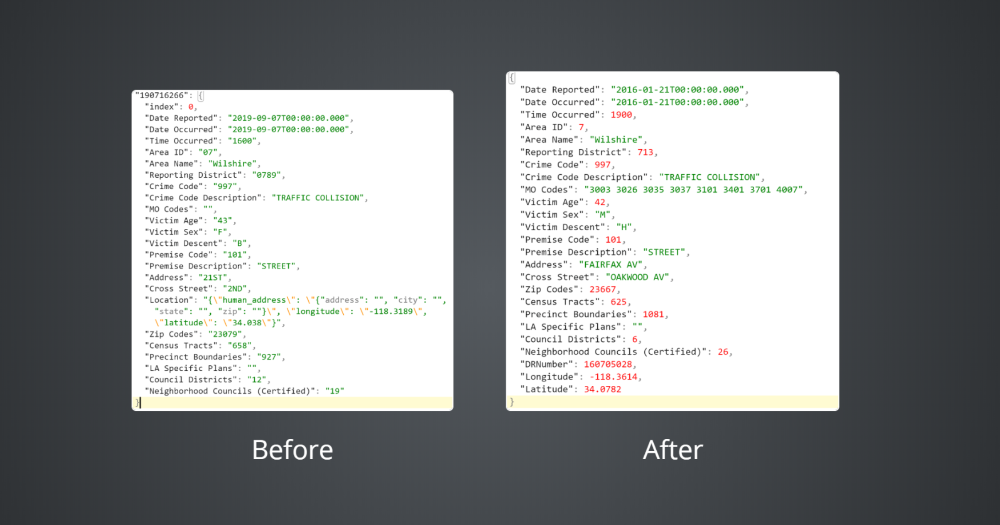

# Midterm Project Report

<h4>
    Tao Xu, Xirui Zhong
    </h4>

    
## Background

LA-Traffic-Collision-Inspector is a web application that can help people to inspect if the traffic collisions are related to certain factors such as gender, time occurred location, etc. It supports filtering, searching, and sorting for better user experience. In order to let use get a better view of dataset, the user interface will consist of a map for data visualization.

## Completed Task

- Data cleaning and analyzing(Tao Xu)
- Project Structure design and implementation(Tao Xu)
- Upload data on Firestore(Tao Xu)
- Building Frontend Demo(Xirui Zhong, Tao Xu)

## Project Structure 

We built this application based on ReactJS, and used Redux as data manipulation tools. Users's action will trigger Communication Module and use RESTful API to request data from Firebase. After the data is retrieved. It will be updated in Redux, and the content on webpage will be updated in the real time. 

## Data Cleaning or Analyzing

We downloaded the CSV document from Kaggle, and used Python to parse and analyze the raw data. In raw format, all the data fields were in format of string, which would be a problem in sorting since the sorting rules of string is different from numbers. We transferred part of data fields to integer and parsed the longitude and latitude of accidents from text content of "Location" data field in raw data to the float format.

## Frontend DEMO

We built the web application based on ReactJS. The frontend project has two main parts, the first is user view which is based on ant design. it basically supports sorting and filtering features on the data loaded in the webpage.

The Second part is Firestore communication module, where we encapsulate all the functions uses Firestore API. 

## To Be Completed after Mid-Term:

- Implement sorting and filtering features interact with backend based on Firebase API
- Customize Front-End UI
- Implement Data Visualization by D3.js
- Build mobile device compatitbility
- Implement cloud function
